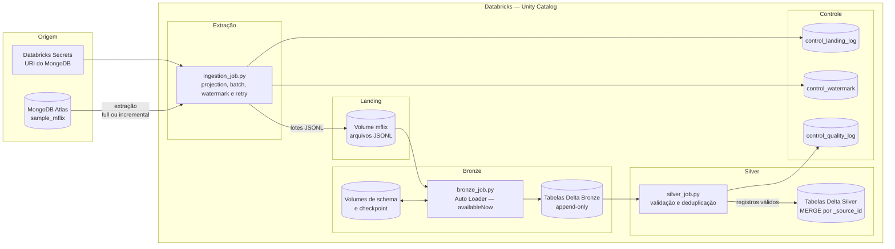

# Arquitetura do Pipeline Mflix

## Objetivo e escopo

O projeto implementa um pipeline batch para ingestão das seis coleções do banco `sample_mflix`, no MongoDB Atlas, para o Databricks Free Edition. A solução utiliza Unity Catalog, Auto Loader e tabelas Delta, seguindo as camadas Landing, Bronze e Silver.

## Fluxo esperado



O fluxo deve ser executado na ordem `ingestion_job.py` → `bronze_job.py` → `silver_job.py`. Cada job percorre sequencialmente as coleções habilitadas em `config/collections.json`.

---

## Camadas

### Landing

- Volume no Unity Catalog: `<catalog>.landing.mflix`.
- Arquivos depositados por `ingestion_job.py` após a leitura do MongoDB.
- Formato JSON Lines, com um documento JSON por linha.
- Cada arquivo contém até `batch_size` registros; portanto, uma execução pode gerar vários arquivos para a mesma coleção.
- Organização e nomenclatura:

```text
<collection>/<collection>__<ingestion_id>__<lote>.json
```

- Tipos BSON, como `ObjectId`, datas, `Decimal128` e bytes, são convertidos antes da escrita.
- A projection é aplicada no MongoDB para evitar a transferência de campos desnecessários ou sensíveis.

### Bronze

- Tabela Delta no Unity Catalog: `<catalog>.bronze.<collection>`.
- Ingestão dos arquivos da Landing com Auto Loader (`cloudFiles`).
- Escrita append-only, sem transformação de negócio.
- Particionamento por `_ingestion_date`.
- Schema explícito por coleção.
- Campos fora do contrato são preservados em `_rescued_data`.
- Checkpoint e schema do Auto Loader são isolados por coleção:

```text
<checkpoint_base_path>/<collection>
<schema_base_path>/<collection>
```

- Colunas técnicas:

| Coluna | Finalidade |
|---|---|
| `_ingestion_id` | UUID técnico gerado na Bronze |
| `_ingestion_timestamp` | instante do processamento Spark |
| `_source_path` | identificação da origem |
| `_source_collection` | coleção do MongoDB |
| `_load_type` | modo `full` ou `incremental` |
| `_ingestion_date` | data da ingestão e partição Delta |
| `_source_id` | representação textual do `_id` de origem |
| `_rescued_data` | dados fora do schema explícito |

### Silver

- Tabela Delta consolidada: `<catalog>.silver.<collection>`.
- Validação de `_source_id`, `_corrupt_record` e `_rescued_data`.
- Registros sem chave, corrompidos ou com dados resgatados são filtrados antes da materialização.
- Deduplicação por `_source_id`, mantendo a versão mais recente.
- Normalização de datas e e-mails quando aplicável.
- Cálculo de `_record_hash` com SHA-256.
- `MERGE` por `_source_id`, inserindo registros novos e atualizando somente registros alterados.

### Control

- `<catalog>.bronze.control_landing_log`: uma linha por tentativa de extração e coleção, com quantidade, duração, watermark, status e erro.
- `<catalog>.bronze.control_watermark`: último watermark confirmado de cada coleção incremental.
- `<catalog>.silver.control_quality_log`: métricas e status do processamento Silver.
- `<catalog>.bronze.control_ingestion_log`: objeto criado pelo job Bronze, mas ainda não alimentado pela implementação atual.

---

## Decisões técnicas

**Formato dos arquivos na Landing:**

```yaml
Decisão: JSON Lines (JSONL)
Justificativa: Permite escrita e leitura progressivas, mantém um documento por linha e é compatível com o Auto Loader. Os arquivos são limitados pelo batch_size para controlar memória e reduzir small files.
```

**Trigger do job Bronze:**

```yaml
Decisão: availableNow
Justificativa: Processa os arquivos disponíveis como uma carga incremental finita, utilizando o checkpoint do Auto Loader, e é compatível com a execução batch no Databricks Free Edition.
```

**Estratégia de idempotência na Bronze:**

```yaml
Decisão: Checkpoint independente por coleção e Bronze append-only
Justificativa: O checkpoint impede que um arquivo já confirmado seja processado novamente. A Bronze preserva o histórico; a consolidação por _source_id é responsabilidade da Silver.
```

**Tratamento de schema drift:**

```yaml
Decisão: Schema explícito por coleção com schemaEvolutionMode igual a rescue
Justificativa: Mantém um contrato previsível e armazena campos inesperados em _rescued_data, evitando descarte silencioso e permitindo análise posterior.
```

**Segurança dos dados de origem:**

```yaml
Decisão: URI no Databricks Secrets e projection aplicada no MongoDB
Justificativa: Evita credenciais no repositório e impede que campos sensíveis ou volumosos sejam transferidos e persistidos sem necessidade.
```

### Modos de carga por coleção

| Coleção | Modo | Watermark field | Justificativa |
|---|---|---|---|
| `movies` | incremental | `lastupdated` | Processar somente filmes atualizados após o último ponto confirmado |
| `comments` | incremental | `date` | Processar somente comentários posteriores ao último ponto confirmado |
| `users` | full | — | Coleção pequena, sem campo de atualização configurado; `password` é excluído na origem |
| `theaters` | full | — | Coleção pequena e de baixa variação |
| `sessions` | full | — | Sem campo de watermark configurado; `jwt` é excluído na origem |
| `embedded_movies` | full | — | Sem campo de watermark configurado; `plot_embedding` é excluído na origem |

---

## Diagrama da solução

O diagrama em **Fluxo esperado** representa a solução implementada: MongoDB Atlas → Landing → Bronze → Silver, incluindo secrets, checkpoints e tabelas de controle.

## Configuração principal

Os nomes de catálogo, schemas e volumes, além de `batch_size`, retries, evolução de schema e trigger, ficam em `config/pipeline_config.yaml`. As coleções, projections, destinos e modos de carga ficam em `config/collections.json`.

Antes da execução, `meu_catalog` e os caminhos `/Volumes/meu_catalog/...` devem ser substituídos ou confirmados conforme o catálogo disponível no workspace.
